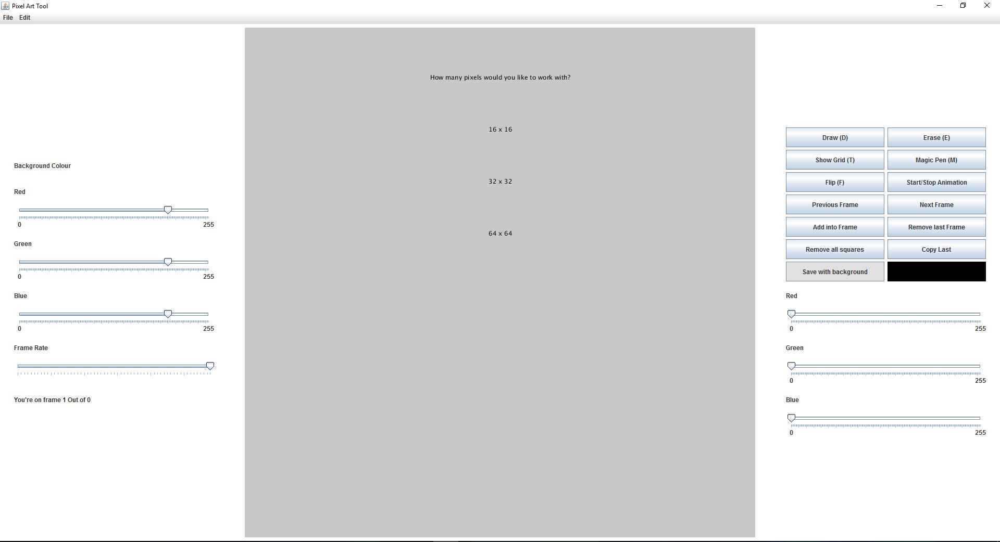

# oopProject3
Programming Project 3

<b>Project members:</b> 
Simon O'Neill 	C14444108 
Ka Yu Chan 		C14465068 
Laurence Cervi 	C14526257 
Cliona Rogers	C14396346 
 

<b>Idea</b>
Our group decided on making a program that would allow the user to test their procedural animations before exporting them to a Processing or Java program.
 

We've decided on using java for this project because since we're learning java it would give us more practise.

  
Some Issues with the pixel art drawing program.

1)Sometimes on laptops with a monitor that's less than 15.6 inch, the processing component cannot be displayed due to the component being too big for the screen.
A solution is to making the processing component smaller by changing the code on line 56 in Frame.java.

Change from:
"Pixel.screenSize = (int) screenHeight - 100;" 
to 
"Pixel.screenSize = (int) screenHeight - 200;"

The interface should look like this:

  
2) There's is a bug with saving a single image in the program(not including saving multiple frames as images), because we forgot to add "pArt.clear();" at the end of the fuction "saveTrans()" in pixel.java.
"pArt.clear();" clears the PGraphics after the image is saved, so it's ready to draw and save the next image.

  
We will be committing changes to fix these issues after the assignment as been assessed.